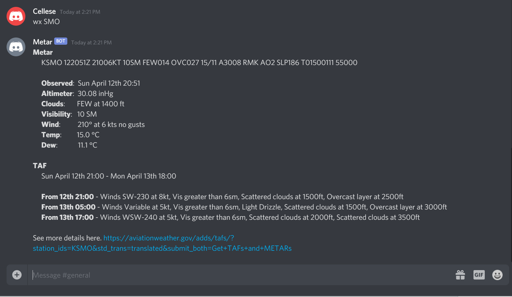

# Metar

Metar is a Discord bot that can provide basic Metar and TAF reports for airports. The data is sourced from https://avwx.rest/ which is mostly parsed data from https://aviationweather.gov/. 

### Usage
The bot doesn't do anything unless someone sends a message with the correct prefix using the following format.

`wx <airport code>`

The airport code can omit the prefixed K or it can be included. For example, you can say `wx KSMO` or `wx SMO`.

And this is what the response would look like.

